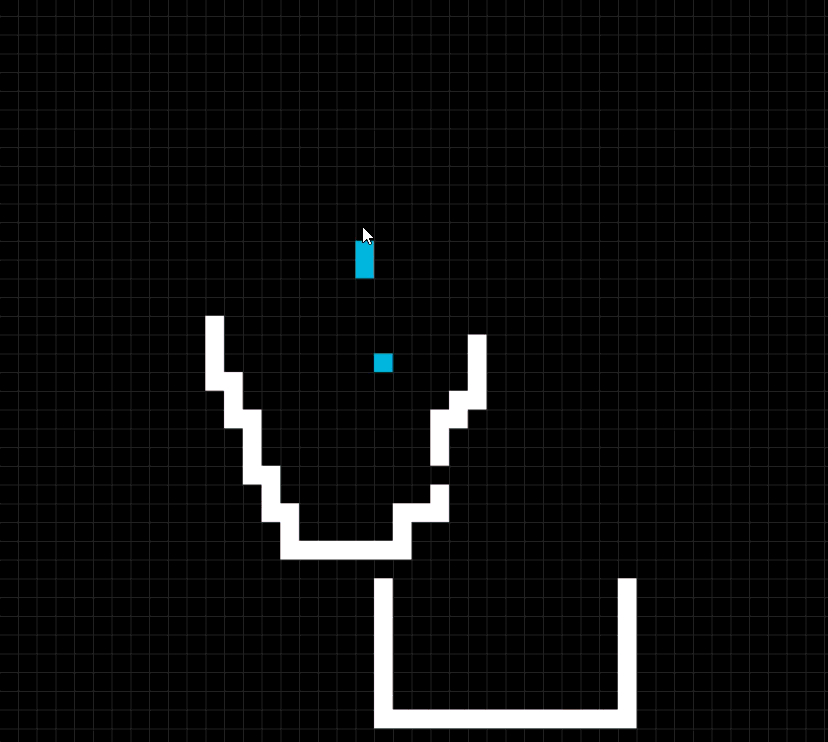

# 🌊 Fluid Simulation 2D (C + SDL2)

Simulation interactive de fluide en 2D en temps réel, basée sur une grille discrète.

---

## 🎬 Démo



---

## 🧠 Principe

- Gravité (écoulement vers le bas)
- Diffusion horizontale
- Gestion simple de la pression

---

## 🎮 Contrôles

- Clic gauche : obstacle
- Clic droit : eau
- Espace : suppression

---

## ⚙️ Build & Run (Windows / MinGW)

```bash
mingw32-make
mingw32-make run
```

---

## 📁 Structure

```
src/
include/
dependencies/
assets/
build/
```

---

## 🚧 Amélioration prévue

- Rendre l’écoulement du fluide plus naturel
  → actuellement basé sur un comportement discret (distribution binaire ~25%)
  → objectif : transition vers un modèle plus continu et réaliste

---

## 👨‍💻 Auteur

Projet personnel en C + SDL2.
